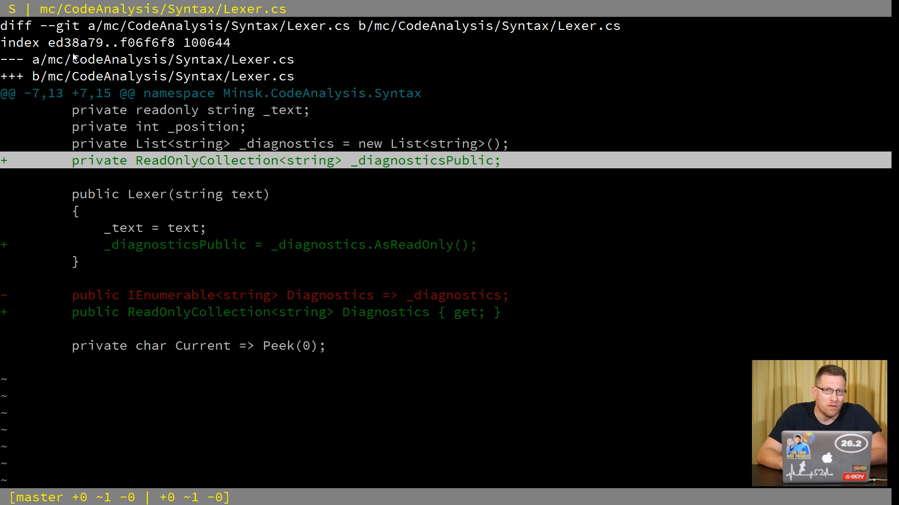

# git istage

This git extension is designed to be a better alternative to `git add -p`.
The goal is to make staging whole files, as well as parts of a file, up to
the line level, a breeze. See [documentation](docs/about.md) for details.

## Installation

    $ dotnet tool install git-istage -g

### CI Builds

    $ dotnet tool install git-istage -g --add-source https://nuget.pkg.github.com/terrajobst/index.json

## Documentation

See [documentation](docs/about.md) for details.

## Missing features

* Support inline search using slash
* Add ability to edit the patch inline